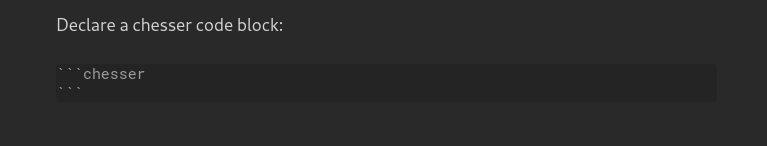

# Chesser

A chess game viewer/editor for [Obsidian](https://obsidian.md/).

## Demonstration


## Usage

To use [Chesser](https://github.com/SilentVoid13/Chesser), you first need to declare a `chess` code block like so:



This will create a basic chess board in the start position.

You can declare various settings **inside** the `chess` code block, like a [FEN](https://en.wikipedia.org/wiki/Forsyth%E2%80%93Edwards_Notation) string to describe a particular board position. You can find the full settings list below.

## Settings

Here are the available settings for a `chesr` code block:

| Name          | Possible Values                                              | Description                                                  |
| ------------- | ------------------------------------------------------------ | ------------------------------------------------------------ |
| `fen`         | A valid FEN string                                           | Starts the chess board with a particular position.           |
| `pgn`         | Either, a valid PGN string formatted for YAML <br /> or the filepath to a `.pgn` file in the same folder | Loads the chess board with the moves from a PGN game         |
| `orientation` | `white`/`black`                                              | Orientation of the board.                                    |
| `pieceStyle`  | A valid piece style name.<br />Check [this](https://github.com/SilentVoid13/Chesser/tree/master/assets/piece-css) to view available styles. | Style of the pieces on the board.                            |
| `boardStyle`  | A valid board style name.<br />Check [this](https://github.com/SilentVoid13/Chesser/tree/master/assets/board-css) to view available styles. | Style of the chess board.                                    |
| `drawable`    | `true`/`false`                                               | Controls the ability to draw annotations (arrows, circles) on the board. |
| `viewOnly`    | `true`/`false`                                               | If enabled, displays a static chess board (no moves, annotations, ...). |
| `free`        | `true`/`false`                                               | If enabled, disables the chess logic, all moves are valid.   |

You can permanently set some settings in [Chesser](https://github.com/SilentVoid13/Chesser)'s obsidian plugin settings.

>   If providing a raw PGN string, it must be properly formatted as a multiline YAML string (pipe to indicate multiline and 2 or 4 spaces for indent) eg;
>  ```
>  pgn: |
>    [Event "Mar del Plata"]
>    [Site "Mar del Plata ARG"]
>    [Date "1960.03.30"]
> 
>    1. e4 e5 2. f4 exf4 3. Nf3 g5 4. h4 g4 5. Ne5 Nf6 6. d4 d6
>    7. Nd3 Nxe4 8. Bxf4 Bg7 9. Nc3 $6 Nxc3 10. bxc3 10... c5
>    11. Be2 cxd4 12. O-O Nc6 13. Bxg4 O-O 14. Bxc8 Rxc8 15. Qg4 f5
>    16. Qg3 dxc3 17. Rae1 Kh8 18. Kh1 Rg8 19. Bxd6 Bf8 20. Be5+
>    Nxe5 21. Qxe5+ Rg7 22. Rxf5 Qxh4+ 23. Kg1 Qg4 24. Rf2 Be7
>    25. Re4 Qg5 26. Qd4 Rf8 27. Re5 Rd8 28. Qe4 Qh4 29. Rf4 1-0
> ```
## TODO

- [ ] Test [PGN](https://en.wikipedia.org/wiki/Portable_Game_Notation) file support

## Installation

After disabling Safe Mode, you can find third-party plugins in Settings > Community plugins > Browse > Search for "Chesser".

After installing, you can then find the installed plugins under Settings > Community plugins. They need to be enabled in order to take effect. You can also uninstall them there.

## Alternatives

- [THeK3nger/obsidian-chessboard](https://github.com/THeK3nger/obsidian-chessboard)

## Contributing

Feel free to contribute.

You can create an [issue](https://github.com/SilentVoid13/Chesser/issues) to report a bug, suggest an improvement for this plugin, etc.

You can make a [pull request](https://github.com/SilentVoid13/Chesser/pulls) to contribute to this plugin development.

## License

[Chesser](https://github.com/SilentVoid13/Chesser) is licensed under the GNU AGPLv3 license. Refer to [LICENSE](https://github.com/SilentVoid13/Chesser/blob/master/LICENSE.TXT) for more informations.

## Support

If you want to support me and my work, you can donate me a little something by clicking [**here**](https://www.paypal.com/donate?hosted_button_id=U2SRGAFYXT32Q).
